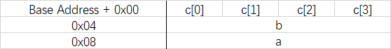
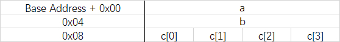
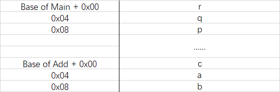
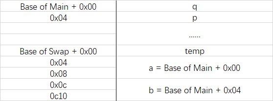

# VG101 Jigang RC 6 - Pointers, File Operation, Debugging, and Commonly-used Algorithms

## Pointers

### Full Memory Distribution in a Function

**Example:**

```C
int main() {
    volatile int a = 0;
    volatile int b = 0;
    char c[] = {1, 2, 3, 4};

    return 0;
}
```

(GCC Compilation)

or

(MinGW Compilation)

### How to Get & Store a Variable's Memory

**Syntax:**

```C
type *ptr = &var;
```

Actually type is not important for the process to get address, actually in any 32-bit program, an address is only a 32-bit integer.

```C
type arr[len];
type *ptr = arr;
```

Notice that array itself is already its address.

### Dereference

**Syntax:**

```C
int *ptr = &a;
int b = *ptr; // Get the value
*ptr = 3; // Change a to 3
```

**Think1:**

Given the ascii code of `a` is `0x61`

```C
int main() {
    unsigned int x = 0x00636261;
    
    printf("%s\n", (char *)(&x));
    return 0;
}
```

What's the result if it's compiled by GCC? Why not `x=0x61626300`? (optional)

Actually if you would work on projects regarding with communication, especially embedded communication, this type of concept is very important.

### Arithmetic Operation of Pointers

Compiler will take care of the increment of memory by its type.

```C
int *iptr = &a;
char *cptr = &c;
iptr++; // Added 4
cptr++; // Added 1
```

**Think2:**

```C
int main() {
    char str[] = "Hello World!";
    
    printf("%s\n", (char *)((int *)str + 1) + 2);
    return 0;
}
```

What's the result if it's compiled by GCC? 

**Think3:**

How to realize the following MATLAB code by C?

```matlab
string = input('Input a string:', 's');
pos = input('Cut from?');
disp(string(pos:length(string)));
```

**Think4:**

How to realize `substring` operation in C?

### Pointer in Function-Call Process

Recall the memory distribution in function-call process (Compiled by GCC):

**Example:**

```C
int add(int a, int b) {
    int c = a + b;
    return c;
}

int main() {
    int p = 1, q = 2;
    
    int r = add(p, q);
    printf("%d\n", r);
    return 0;
}
```



If we use integer as function argument, we could access local variable from another function (Compiled by GCC).

**Example:**

```C
void swap(int *a, int *b) {
    int temp = *a;
    *a = *b;
    *b = temp;
}

int main() {
    int p = 1;
    int q = 2;
    
    swap(&p, &q);
    printf("%d %d\n", p, q);
    
    return 0;
}
```



So we could use swap to change local variables of main function.

**The first way to simulate multiple return values in C is to pass pointer (address) as function argument.**

### Wild Pointer

**Example:**

```C
int main() {
    char *name;
    
    printf("Input your name:");
    scanf("%s", name);
    
    printf("Hello %s\n", name);
    return 0;
}
```

What's the problem?

Pointer that is not assigned to a known position that is allocated is called **wild pointer**. We should avoid wild pointer in our programs.

There is another cause of wild pointer.

**Example:**

```C
int *createArray() {
    int arr[100];
    return arr;
}

int main() {
    int *arr = createArray();
    
    arr[0] = 100;
    
    printf("%d\n", arr[0]);
    
    return 0;
}
```

What's the problem?

See the following code:

```C
int *initializePointer(int value) {
    int *ret = &value;
    return ret;
}

int main() {
    int *ptr1 = initializePointer(100);
    int *ptr2 = initializePointer(1000);

    printf("%d\n", *ptr1);

    return 0;
}
```

Do not return the address of a local variable!

### Library of Pointers - stdlib

1. `memset` function.
2. `memcpy` function.

## File I/O

### File Pointer

In convenience for seeking and jumping in a file, we introduce the concept of file pointer in C.

**Syntax:**

```C
FILE *fp = fopen("filename", 'access');
```

What if we don't call `fclose` after `fopen`?

Using file pointer, we can easily go to certain position of a file, for example:

```C
fseek(fp, 7, SEEK_SET);
```

is to skip to the 7th character of the file, and

```C
fseek(fp, 5, SEEK_CUR);
```

can skip 4 characters from the current position.

### Scanning in Regular Format

Actually, we can not only use the identifiers `%d`, `%f`, etc, in C language. We can use more complicated expressions after `%` symbol, for example:

```C
fscanf(fp, "%[^\n]", str);
```

will read all the characters before line change, ignoring spaces and other separators.

The syntax in total is:

```
%[*] [width] [{h | l | I64 | L}]type
%[*][^ignore]
```

It's a simple version of **regular expression**.

**Example:**

Read until next comma:

```C
scanf("%[^,],", str);
```

### `stdin` and `stdout` Redirection

Using `freopen` function, we could reopen `stdin` and `stdout` so that we could use normal I/O functions write to a file. This is actually not recommended in real-life programming because it will be uninvertible.

## Debugging (using CLion for Example)

### Breakpoints

You could stop your program at certain places by setting up **breakpoints**, you can also set conditions to breakpoint if you are within a loop.

### Watch & Evaluate

Watch can watch the value of a certain expression each step when the program executes. Evaluate only calculate it once.

You can also inject value to some variable using evaluate function.

### Memory View

You can also watch a variable in memory view to inspect whether it cause memory problem.

## Commonly-used Algorithms

### Dual Pointer Algorithm

In string processing, often we need to verify if a substring of any possible length have certain property. At this time, we could use two pointers (or index indicators) to solve the problem and write a O(n^2) algorithm easily. For example, if we need to find the longest non-duplicate substring:

```C
void find(char *dest, char *src) {
    char *ptr1 = src;
    unsigned int maxLen = 0;
    char *maxStart = NULL;

    while (*ptr1 != 0) {
        char *ptr2 = ptr1;
        char hashTable[256] = {0};

        while (*ptr2 != 0 && !hashTable[*ptr2]) {
            hashTable[*ptr2] = 1;
            ptr2++;
        }

        if (ptr2 - ptr1 > maxLen) {
            maxLen = ptr2 - ptr1;
            maxStart = ptr1;
        }

        ptr1++;
    }

    strncpy(dest, maxStart, maxLen);
    dest[maxLen] = 0;
}
```

### DFS

DFS is called Depth First Search. It is used when a tree-like structure is used to go through all the possible paths in a tree recursively. 

General procedure is:

1. Visit the current Node
2. DFS the left sub-tree is there is one
3. DFS the right sub-tree is there is one

Generally speaking with tree structure is hard to understand, we could introduce a simple example.

## 

A traveler is trapped in the center of a desert, in which he faces the problem of finding water supply. Luckily, there are water sources in this desert and he have got a map about where the sources are located. Please write a C program to help him walk out of the desert as fast as possible.

1. The desert is a circle of radius 100km, and the traveler starts at position (0, 0), which is the center of the desert.
2. Initially the traveler have 1L water supply.
3. It takes the traveler 2 seconds and 1mL water to travel 1 meter.
4. In each water source, a traveler can obtain 1L of water supply and he has infinitely large water bag.
5. To obtain 1L water takes him 1 minute.
6. The water source is empty after it's used once.

**Input format**:

1. The first line contains the count of water sources (N < 100)
2. The following N lines contains all the positions of the water sources in the format `X Y`

**Output format**:

Just output the smallest time it takes the traveler to get out of the desert. If the traveler is doomed to die in the desert, output "x".

## 

(this originally one of the LAB6 questions)

The code is attached:

```C
#include <stdio.h>
#include <math.h>

typedef long long LL;

typedef struct source_t {
   LL x;
   LL y;
   int visited;
} source_t;

#define MAX_SOURCE_CNT 1001

typedef struct source_arr_t {
    source_t arr[MAX_SOURCE_CNT];
    int len;
} source_arr_t;

#define MAX_STACK_LEN 100

typedef struct stack_t {
    int arr[MAX_STACK_LEN];
    int top;
} stack_t;

void push(stack_t *stack, int elt) {
    stack->arr[stack->top++] = elt;
}

int pop(stack_t *stack) {
    return stack->arr[--stack->top];
}

int top(const stack_t *stack) {
    return stack->arr[stack->top - 1];
}

double distance(const source_t *p1, const source_t *p2) {
    return sqrt(pow((double)(p1->x - p2->x), 2) + pow((double)(p1->y - p2->y), 2));
}

double norm(const source_t *point) {
    return sqrt(pow((double)(point->x), 2) + pow((double)(point->y), 2));
}

double dfsHelper(source_arr_t *source, stack_t *stack, double *water, double *time, int cur) {
    static double maxTime = -1;

    // 1. Visit
    source_t *ref = &source->arr[cur];
    double dist = distance(ref, (source->arr + top(stack)));
    *water += -dist + 1000;
    *time += dist * 2 + 60;
    ref->visited = 1;

    // 0. Push Stack
    push(stack, cur);

    double remain = 10000 - norm(ref);
    if (remain <= *water) {
        if (maxTime == -1 || *time + remain * 2 < maxTime) maxTime = *time + remain * 2;
    } else {
        // 2. Recursion
        for (int i = 0; i < source->len; i++) {
            if (source->arr[i].visited) continue;
            if (distance(ref, source->arr + i) > *water) continue;
            dfsHelper(source, stack, water, time, i);
        }
    }

    // 3. Recurse
    pop(stack);
    *time -= dist * 2 + 60;
    *water += dist - 1000;
    return maxTime;
}

int main() {
    int N;
    scanf("%d", &N);


    source_arr_t sourceArr;
    sourceArr.arr[0].x = 0;
    sourceArr.arr[0].y = 0;
    sourceArr.arr[0].visited = 0;
    sourceArr.len = 1;

    for (int i = 0; i < N; i++) {
        LL x, y;
        scanf("%lld %lld", &x, &y);
        sourceArr.arr[sourceArr.len].x = x;
        sourceArr.arr[sourceArr.len].y = y;
        sourceArr.arr[sourceArr.len++].visited = 0;
    }

    double water = 0;
    double time = 0;

    stack_t stack;

    double maxTime = dfsHelper(&sourceArr, &stack, &water, &time, 0);

    if (maxTime != -1) printf("%lf\n", maxTime - 60);
    else printf("x\n");

    return 0;
}
```

**Optional:**

Another more difficult question of DFS is to solve the Egyptian-fraction problem: (Lab4 in FA2018)

Any fraction can write in such form:
$$
\frac{a}{b}=\sum{\frac{1}{n_i}},\forall i\neq j,n_i\neq n_j
$$
We define the fraction to be better if we need less "n"s. We need to find an algorithm to solve for the best Egyptian-fraction combination.

Code is attached:

```C
#include <stdio.h>

#define max(a, b) ((a>b)?a:b)
#define min(a, b) ((a>b)?b:a)

#define maxResNum 100000

#define true 1
#define false 0

typedef long long LL;
typedef int bool;

// Declare some global variables in the heap to avoid stack overflow
LL fMin, maxDepth, ans[maxResNum], partial[maxResNum];
bool flag;

/*Proccess the DFS
 *x,y is the fraction left to proccess, depth isthe current depth
 */
void proccess(LL x, LL y, LL depth) {
    LL cMin, cMax;
    if(depth == 0)
        cMin = y/x;
    else cMin = max(partial[depth - 1] + 1, y / x); // Most lower bound
    cMax = min((y / x) * (maxDepth - depth + 1), fMin - 1); // Least upper bound
    for (LL cur = cMin; cur <= cMax; cur++) {
        LL xNext, yNext;
        partial[depth] = cur;
        xNext = x * cur - y;
        yNext = y * cur;
        if (x >= 0 && depth < maxDepth) proccess(xNext, yNext, depth + 1);
        if (xNext == 0 && cur < fMin) {
            fMin = cur;
            flag = true;
            for (LL j = 0; j < maxDepth + 1; j++) ans[j] = partial[j];
        }
    }
}

int main() {
    // Do some input stuff
    int a, b;
    scanf("%d %d", &a, &b);
    // Initialization
    flag = false;
    maxDepth = 0;
    // Iteration increase depth
    while (!flag) {
        fMin = 9223372036854775807;// max of long long
        proccess(a, b, 0);
        maxDepth++;
    }
    // Output the ans
    for (LL i = 0; i < maxDepth; i++) printf("%lld ", ans[i]);
    printf("\n");
    return 0;
}
```

If you are interested, you can even use DFS to solve for other problems like Sodoku. And the recursion method in LAB5 can more or less been regarded as DFS.


We could also use Stack to make recursion-free DFS:

```C
int DFS(tree T) {
    Stack s;
    push(s, T);
    while (!isEmpty(s)) {
        tree cur = pop(s);
        visit(cur->root);
        if (cur->left) push(s, cur->left);
        if (cur->right) push(s, cur->right);
    }
}
```

### BFS

BFS is called Breath First Search. It goes through the tree layer by layer. In BFS process, we could use a Queue structure instead of stack to modify the recursion-free DFS to BFS. This algorithm is useful in path-finding, image-coloring, etc.

```C
int BFS(tree T) {
    Queue q;
    enqueue(q, T);
    while (!isEmpty(q)) {
        tree cur = dequeue(q);
        visit(cur->root);
        if (cur->left) push(s, cur->left);
        if (cur->right) push(s, cur->right);
    }
}
```

**Example:**

(FA18 Final Question)

Given a graph of ASCII art, which only contains "#" and "*" character, and given two numbers that is the coordinate of the graph. Fill the connecting region from that point with " ".

**Input:**

1. The width and height of the graph
2. A Graph
3. A pair of integers.

```C
#include <stdio.h>

typedef struct Point {
    int x, y;
} Point;

int main() {
    int width, height;
    scanf("%d %d", &width, &height);
    getchar();

    char graph[50][50];
    for (int i = 0; i < height; i++) {
        scanf("%[^\n]\n", graph[i]);
    }

    int x, y;
    scanf("%d %d", &x, &y);

    char identifier = graph[x][y];
    char closed[50][50] = {0};

    Point queue[255];
    int front = 0, rear = 0;

    queue[rear].x = x;
    queue[rear++].y = y;

    while (rear != front) {
        Point cur = queue[(front++) % 255];
        graph[cur.x][cur.y] = '#';

        if (cur.x - 1 >= 0 && closed[cur.x - 1][cur.y] == 0 && graph[cur.x - 1][cur.y] == identifier) {
            queue[rear % 255].x = cur.x - 1;
            queue[(rear++) % 255].y = cur.y;
            closed[cur.x - 1][cur.y] = 1;
        }
        if (cur.y - 1 >= 0 && closed[cur.x][cur.y - 1] == 0 && graph[cur.x][cur.y - 1] == identifier) {
            queue[rear % 255].x = cur.x;
            queue[(rear++) % 255].y = cur.y - 1;
            closed[cur.x][cur.y - 1] = 1;
        }
        if (cur.x + 1 < height && closed[cur.x + 1][cur.y] == 0 && graph[cur.x + 1][cur.y] == identifier) {
            queue[rear % 255].x = cur.x + 1;
            queue[(rear++) % 255].y = cur.y;
            closed[cur.x + 1][cur.y] = 1;
        }
        if (cur.y + 1 < width && closed[cur.x][cur.y + 1] == 0 && graph[cur.x][cur.y + 1] == identifier) {
            queue[rear % 255].x = cur.x;
            queue[(rear++) % 255].y = cur.y + 1;
            closed[cur.x][cur.y + 1] = 1;
        }
    }

    for (int i = 0; i < height; i++) printf("%s\n", graph[i]);
}
```

