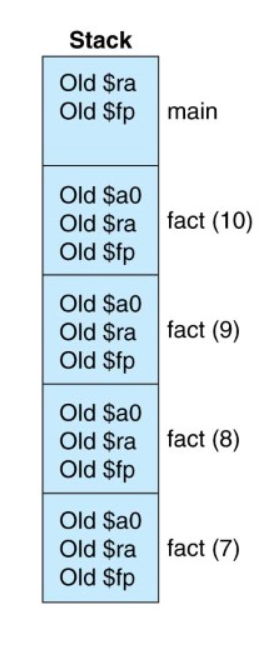
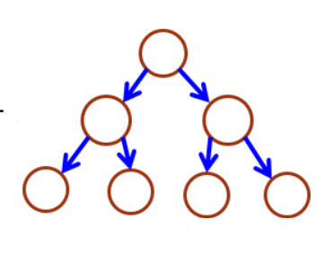
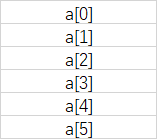

# VG101 Jigang RC5 - Recursion, Array, Algorithm and Data Structure

## Recursion

### Recall Memory Distribution during Function Call



When a function is called, all the local variables are stored in a top-down structure called stack.

### When a Function Calls Itself

When a function calls itself, a new stack frame is created, and thus the local variables within two functions don't distribute each other. So we could use recursive calls to solve recursive problems.

### Recursive Problems and Recursive Calls

Mathematically, there are many structures with recursive property. For example, the factorial operations is defined as below:
$$
0!=1\\
n!=n(n-1)!
$$
So in programming, when we want to solve these recursive problems, we could use recursive calls. Such factorial problem can be solved as:

```C
int factorial(int n) {
    if (n == 0) return 1;
    return n * factorial(n - 1);
}
```

Another example is when regarding an array, mathematically it can be defined:
$$
a_1, a_2, ...\\
a_n=f(a_{n-1}, a_{n-2}, ....)
$$
A concrete example can be the Fibonacci series:
$$
a_1=1,a_2=1\\
a_n=a_{n-1}+a_{n-2}
$$
When we want to calculate an item of Fibonacci series, we could have:

```C
int fibonacci(int n) {
    if (n == 1 || n == 2) return 1;
    return fibonacci(n - 1) + fibonacci(n - 2);
}
```

What's the problem of this algorithm?

When we use more abstract data structures, we could also use recursive strategies.

A binary tree is shown as below,



with the following mathematical representation:
$$
tree=(root\rightarrow left, root, root\rightarrow right)
$$
with the right of the root and the left of root is still a subtree with the root's child node of the tree. When we want to search for an item in such a tree, we could still use the recursive property.

```C
bool search(Tree t, int elt) {
    if (t.root == elt) return true;
    if (t.left && search(t.left, elt)) return true;
    if (t.right && search(t.right, elt)) return true;
    return false;
}
```

This algorithm is called DFS. You may not be able to construct such data structure now, but trees could also be disguised in other algorithm problems.

## Array

### Memory Distribution of Continuous Variable



In the top-down structure of function stack, an array is distributed as a continuous variable. So the position of a[1] is right after the position of a[1]. In C, the length of a variable is not **explicitly stored** in the array. (But actually the allocated length is stored and we could also use invariance principles to store the length data inside the array).

### Array Initialization

In C language, we need to allocate exact amount of space to store an array. So we should initialize the array with its length.

```C
int arr[len]; // Before C99, len could only be a number or a constant; After C99, it could also be a variable (VLA)
```

We could also initialize an array with its content and C compiler will automatically determine its length.

```C
int arr[] = {1, 2}; // Length is 2
```

When we declare a `char` array, there is another way to initialize:

```C
char str[] = "123"; // Length is 4, a '\0' is appended after "123"
```

Note that the content of the array don't necessarily be 0, actually, it's the stack content of the previously returned functions. So, we need to initialize the content before we read from then (especially important for strings).

```C
char str[] = {0}; // Initialize the string with bare '\0's.
```

### Array as an Address / Address as an Array

In C, actually an array stores the address of its first element in memory. And the reverse process also applies in C. For example, 

```C
int a = 1;
(&a)[0]; // Gives an 1
(&a)[0] = 1; // Change a to 2
```

So what happens if we use:

```C
int a = 1;
int b = 2;
(&a)[1] = 3;
```

We could also use the dereference `*` operator to obtain the value form an address directly.

```C
int arr[] = {1, 2};
printf("%d\n", *arr); // 1
printf("%d\n", *(arr + 1)) // 2, the same as arr[1]
```

### Array as Function Argument

We can pass an array as an address to a function.

```C
int fun(int arr[]) {
    printf("%d\n", arr[0]);
}

int main() {
    int arr[] = {1, 2};
    fun(arr); // 1
    return 0;
}
```

However, it doesn't contain any information or restriction of the length of the array. So often we pass the array together with its length.

Change the value of array from another function is possible because it is an address copy instead of a variable copy.

```C
int fun(int arr[]) {
    arr[0] = 2;
}

int main() {
    int arr[] = {1};
    fun(arr);
    printf("%d\n", *arr); // 2
    return 0;
}
```

So passing arrays, or addresses, is a method to pretend to return multiple values (exactly what `scanf` does).

## Advanced I/O Knowledge

### Input Buffer

Any input values are stored as a `char` array before its read by `scanf` or other input functions, this array is called input buffer. If we enter "1+Enter", in the buffer, it will store "1\n". So, when we use

```C
scanf("%d", &a);
char c = (char)getchar();
```

value of `c` will become "\n".

So if we want to read the next character correctly, we need to clear the buffer. The general way is to use

```C
while ((char)getchar() != '\n');
```

which will get character until this line ends.

### `scanf` to Arrays

In C, we don't have convenient functions in MATLAB to form input as an array. So we still use `scanf` to handle most cases in array reading.

```C
int main() {
    int arr[1];
    scanf("%d\n", arr);
    printf("%d\n", *arr);
    return 0;
}
```

## Algorithms & Data Structures

### Principle of Data Structure

Data structure is a pre-defined group of data with some internal mathematical relationship and support some specific operations. For example, a "set" structure is:

1. A series `arr` 
2. No duplicate members
3. Support "insertion",  "deletion", "search" and "print" methods

To implement a data structure in C language, we need to find the proper data type to store the information for the `arr`, an array is not enough because we still need to variate its length, so we need a huge array `arr` which is longer than any possible element count in the set, and create a variable `length` to indicate its length.

```C
int arr[MAX_SIZE], length = 0;
```

Then, we need to satisfy the mathematical relation "No Duplicate Members" during the operations ("insert", to make it specific).

```C
/**
* METHOD: insert
* RETURNS: the new array length
**/
int insert(int arr[], int length, int elt) {
    // 1. If there is variable in arr, do nothing
    for (int i = 0; i < length; i++) {
        if (arr[i] == elt)
            return length;
    }
    // 2. If not, insert arr
    arr[length] = elt;
    return length + 1;
}
```

This process is called "invariance" in professional programing conversations.

### Some Common Data Structures

1. Stack

   Stack is the data structure that following "LIFO" (last in first out) principle. Mathematically, 

   - A series `arr`
   - Pop the most recently pushed element first
   - Support "push" and "pop" methods.

   How to implement? Use an array and a top that indicates the first unused element in the array

   ```C
   int arr[MAX_SIZE], top = 0;
   ```

   Push operation?

   ```C
   arr[top++] = elt;
   ```

   Pop operation?

   ```C
   elt = arr[--top];
   ```

2. Queue

   Queue is the data structure that following "FIFO" (first in first out) principle. Mathematically, 

   - A series `arr`
   - Dequeue the oldest element
   - Support "enqueue" and "dequeue" methods.

   How to implement? Using circular array and the "front" and "rear" indicators.

   ```C
   int arr[MAX_SIZE], front = 0, rear = 0;
   ```

   Enqueue?

   ```C
   arr[(front++) % MAX_SIZE] = elt;
   ```

   Dequeue?

   ```C
   elt = arr[(++rear) % MAX_SIZE];
   ```

3. Hashmap

   Hashmap is the data structure that maps a set of variable to numbers. 

   - A list `arr`
   - Index is corresponding to a variable in the domain set
   - Support "insert", "delete", "formArray" operations

   We first need a "Hashing Function" to create this relationship. We won't talk about this until VE281, but we could know the most simple hashmap, which is the alphabetic hashmap.

   How to implement?

   ```C
   int map[26] = {0};
   ```

   How to insert?

   ```C
   map[ch - 'a']++;
   ```

   How to delete?

   ```C
   map[ch - 'a']--;
   if (map[ch - 'a'] < 0) map[ch - 'a'] = 0;
   ```

   Output an array?

   ```C
   void formArray(char target[], int map[]) {
       int top = 0;
       for (int i = 0; i < 26; i++) {
           for (int j = 0; j < map[i]; j++) target[top++] = 'a' + j; // What's this structure?
       }
   }
   ```

### Algorithms

Algorithm is to make calculations and operations based on certain data structure. An algorithm has three basic indicators:

1. Correctness
2. Time Complexity
3. Space Complexity

For example, in the above-mentioned Fibonacci series structure, we can abstract the process to calculate the nth element of the series to be an algorithm. 

```C
int fibonacci(int n) {
    if (n == 1 || n == 2) return 1;
    return fibonacci(n - 1) + fibonacci(n - 2);
}
```

1. Is it correct? Yes
2. Time complexity? O(2^n), very slow!
3. Space complexity? O(2^n), huge!

So we need to optimize the algorithm using the properties of the data structure. We found that the algorithm has a lot to do with duplicated elements. We can execute from bottom to top and pre-store some element to make it faster.

```C
int fibonacci(int n) {
    if (n == 1 || n == 2) return 1;
    int prev = 1, pprev = 1;
    while (n-- > 2) {
        int temp = prev;
        prev += pprev;
        pprev = prev;
    }
    return prev;
}
```

1. Is it correct? Yes
2. Time complexity? O(n), good
3. Space complexity? O(1), constant!

If it can be further optimized? Yes!

**If I don't have time, I will skip this part**

We could write the Fibonacci series in matrix form:
$$
\begin{pmatrix}a_n\\a_{n-1}\end{pmatrix}=\begin{pmatrix}1&1\\1&0\end{pmatrix}\begin{pmatrix}a_{n-1}\\a_{n-2}\end{pmatrix}
$$
Then we could find
$$
\begin{pmatrix}a_n\\a_{n-1}\end{pmatrix}=\begin{pmatrix}1&1\\1&0\end{pmatrix}^{n-2}\begin{pmatrix}1\\1\end{pmatrix}
$$
Then the question becomes: How to calculate the power quickly?

We can use the idea of binary numbers, take
$$
a^{21}
$$
as an example:
$$
21=(1 0 1 0 1)_2
$$
So,
$$
a^{21}=a^{16}a^{4}a
$$
We could only calculate
$$
a^{2^n}
$$
and combine them to form the answer.

So we can have the code:

```C
#include <stdio.h>

void multiply(long long dest[], long long a[], long long b[]);
long long fibonacci(long long n);

int main() {
	long long n;
	scanf("%lld", &n);
	printf("%lld\n", fibonacci(n));
	return 0;
}

long long fibonacci(long long n) {
	if (n == 1 || n == 2) return 1;
    n -= 2;
    long long coefficient[4] = {1, 1, 1, 0};
    long long result[4] = {1, 0, 0, 1};
    while (n) {
        long long temp[4] = {1, 0, 0, 1};
        if (n & 0x1) {
            multiply(temp, result, coefficient);
            result[0] = temp[0];
            result[1] = temp[1];
            result[2] = temp[2];
            result[3] = temp[3];
        }
        multiply(temp, coefficient, coefficient);
        coefficient[0] = temp[0];
        coefficient[1] = temp[1];
        coefficient[2] = temp[2];
        coefficient[3] = temp[3];
        n >>= 1;
    }
    return result[0] + result[1];
}

void multiply(long long dest[], long long a[], long long b[]) {
    dest[0] = a[0] * b[0] + a[1] * b[2];
    dest[1] = a[0] * b[1] + a[1] * b[3];
    dest[2] = a[2] * b[0] + a[3] * b[2];
    dest[3] = a[2] * b[1] + a[3] * b[3];
}

```

1. Is it correct? Yes
2. Time complexity? O(logn), wow!
3. Space complexity? O(1), constant!

### LAB Hint - Parsing

In LAB5, you need to realize a simple interpreter, but it's difficult to hand on writing because parsing the expression is difficult. Actually, we don't need to do the whole expression at the same time, but use a stack or use recursive methods to do it.

1. Stack Method, which is written on the handout
   - Transform the expression into RPN (reverse polish expression)
   - Calculate the RPN
2. Recursive Method
   - Find all the "(" marks, and find the matched ")" pair (using stack!)
   - Do recursion to calculate the value inside "()"
   - Calculate multiplication and division
   - Calculate addition and subtraction